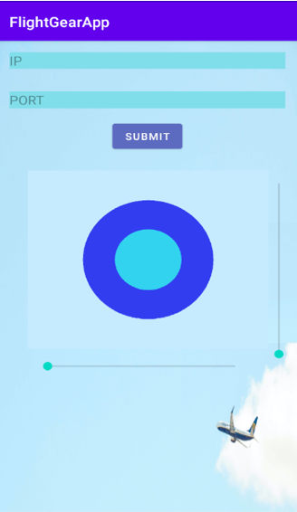

# Fligt Gear App
### General
In this project, we built an Android Application, which allows us to control the flight of the aircraft and connect to the Flight Gear over TCP. We used the MVVM architecture, Client-Server architecture, and parallel programming.

### Repositories structure
- View Model folder - contains the view model src code.
- Model folder - contains the model src code.
- View folder - contains the MainActivity and the Joystick src code.
The app offers the following options:
	- Connect to the Flight Gear according to given IP and port.
	- Fly the airplane.
  
### Installing and Running Instructions
- Clone the repo
- Run the Flight Gear simulator with the following settings:
--telnet=socket,in,10,127.0.0.1,6000,tcp
- Run the app, write your own IP and 6000 as the port and press submit
- Fly the airplane!

### Video
[The video with sound](FG_app_video.mp4) - need to download before watching.

